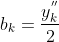
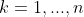
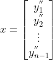

# Polynomial Interpolation

## Introduction
Python application which makes graphs interpolating functions (and splines) from python functions or csv files.

## Motivation
An interpolation function can be used to know unknown values in a data set. There are different ways to find these values.

## Methods
Each point (x, y) of the data set can be interpreted by the following equation:

### Linear System
To find the "a" coefficients, we can use a linear system:

### Lagrange

Another more efficient method than using linear system, is the lagrange method:

The cofficient can be obtained from:

### Newton
The biggest problem with the Lagrange method is when a new value (x, y) is added, the polynomial function has to be rewritten. To solve this problem, we can use the newton method.

The cofficient can be obtained by divided differences:

## Splines

The previous methods help a lot to "estimate" data. But they are "inefficient" for a large data set (polynomial degree gets too large) and functions with uniform distribution (for example: Runge Function). To solve this, we can make polynomial functions between each two nodes.

### Linear Spline

Linear splines makes a straight line for every two nodes

### Cubic Spline

Cubic splines have a third degree k-equation for every two nodes

The cofficients can be obtained from:

for 

From the list of equations above, we have:

## The Application

### Function

### CSV File

## Resources and Tools

https://convertio.co/pt/mkv-gif/

https://plotly.com/

https://hackmd.io/

https://www.codecogs.com/latex/eqneditor.php?lang=pt-br

